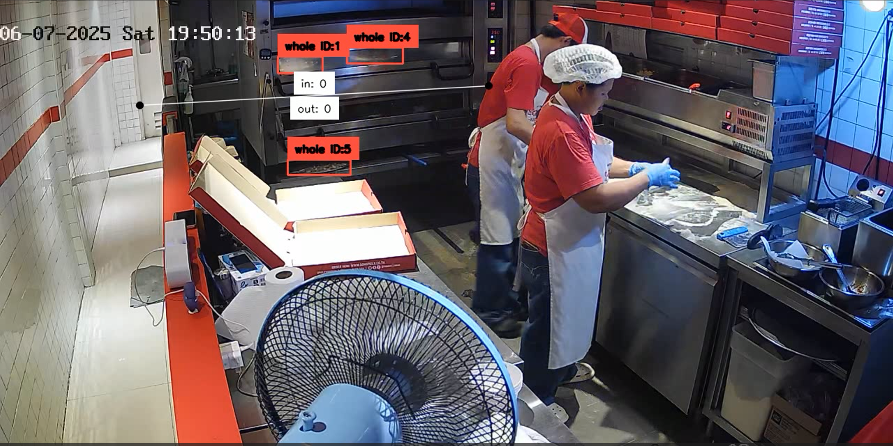

# Pizza sale counting

This project utilized YOLO11x to detect and count the number of pizzas sold in a period of time.

## 1. Installation
- Clone repo to your machine.
    
    ``` cd pizza-counting ```

    ```docker build -t pizza-counting . ```

## 2. File requirement

- best.pt is larger than 100MB, therefore, i could not push it to github, please download manually: https://drive.google.com/file/d/132BtGroW1dugbQdbr6Kd3MsrjLBop3YT/view?usp=sharing
- the video being processed is ```SOHO_1462_CH03``` will also need to be downloaded manually: https://drive.google.com/file/d/11LSPgLVhZftVhe3ft1kRIawGMdTPReiK/view?usp=sharing
- after finishing, move the ```best.pt``` to folder ```pizza-counting/app/``` and move the video to ```pizza-counting/videos/```

## 3. Usage
- Run docker with command

    ```docker run --rm -v ${PWD}/videos:/app/videos -v ${PWD}/app/main.py:/app/main.py -e INPUT_VIDEO=/app/videos/1462_CH03_20250607192844_202844.mp4 -e OUTPUT_VIDEO=/app/videos/output107.avi pizza-counting```

- Change the range of video going to be processed by adjusting ```START_FRAME``` and ```END_FRAME``` in the ```main.py``` file.
- Change the video file name in the command above to match your video filename if needed.



## 4. Brief

- About the deployment
    - Sorry for this incovenient set up, i will try to find another way for deployment.
      
- About the system
    - YOLO11x is good at detecting "pizza" in the frame but the performance is affected by motion blur.
    - During processing the system may miss counting because the pizza was covered by the staff while passing triggering line.
